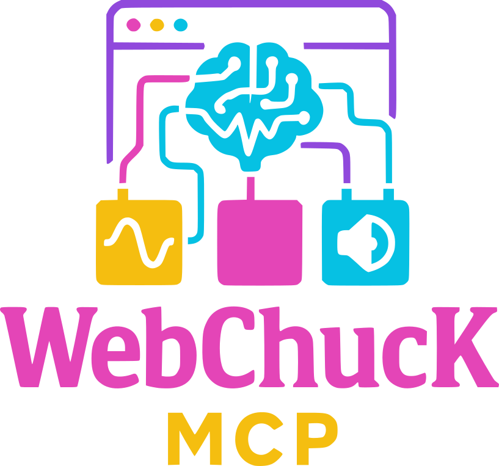

# WebChucK MCP: Browser-Based ChucK with AI Integration

<div align="center">
  


_A browser-based ChucK audio programming environment with AI assistance through Model Context Protocol_

</div>

## Overview

WebChucK MCP is a sophisticated browser-based implementation of the [ChucK](https://chuck.stanford.edu/) audio programming language integrated with the [Model Context Protocol (MCP)](https://modelcontextprotocol.io/) for AI assistance. This platform allows users to write, execute, and interact with ChucK code in a web environment, providing features for real-time parameter control, audio visualization, code management, and more.

<!--img src="images/screenshot.png" alt="WebChucK MCP Interface" width="800"-->

## Features

### Core Features
- **Browser-based ChucK Execution**: Run ChucK code directly in your browser without installation
- **Real-time Code Execution**: Write and execute ChucK code with immediate audio feedback
- **Sample Library**: Browse, search, and use audio samples in your compositions
- **Audio Recording**: Record from your microphone and save as samples
- **Code Library**: Save and manage snippets for reuse

### Advanced Features
- **Real-time Parameter Control**: Extract and modify parameters from running code
- **Audio Visualization**: View waveform, spectrum, and level visualizations
- **Dark/Light Theme**: Fully customizable theming with system preference detection
- **AI Integration**: Connect with AI assistants through Model Context Protocol

## Quick Start

1. Clone the repository:
   ```bash
   git clone https://github.com/yourusername/webchuck-mcp.git
   cd webchuck-mcp
   ```

2. Install dependencies:
   ```bash
   npm install
   ```

3. Add to your Claude or Other client config:

```json
{
  "mcpServers": {
   "webchuck_mcp" : {
      "command": "npx",
      "args": [
        "tsx",
        "C:\\Path\\To\\webchuck_mcp\\index.ts"
      ],
      "env": {
        "WORKING_DIRECTORY" : "C:\\Path\\To\\webchuck_mcp"
      }
    }
  }
}
```

4. Open your browser and navigate to:
   ```
   http://localhost:3030
   ```

5. Click "Connect to WebChucK".

6. Prompt Claude to produce a soundscape with custom controls.

7. (Optional) Open http://localhost:3030 in more tabs for more sessions.

## Using WebChucK MCP

### Basic Workflow

1. **Connect to WebChucK**: Click "Connect to WebChucK" to initialize the audio engine
2. **Connect to Server**: Should attempt to auto-connect, or click "Connect to Server" to establish WebSocket connection
3. **Ask AI to Write Code**: Ask your AI agent to write ChucK code for your composition
4. **AI Debugs And Executes Code**: AI will debug and execute the code in WebChucK  
5. **Interact**: Use parameter controls to modify running code in real-time
6. **Save Snippets**: Save the good stuff to reuse and layer later!

### Parameter Controls

The following parameter annotations in code adds real-time control:

```chuck
// @param float for controlling gain
// @range 0.0 1.0
float gain = 0.5;

// @param int for frequency values
// @range 220 880
int freq = 440;

SinOsc osc => dac;
gain => osc.gain;
freq => osc.freq;
2::second => now;
```

### Audio Visualization

The interface provides three visualization types:
- **Waveform**: Time-domain representation of the audio
- **Spectrum**: Frequency-domain representation with colorful bars
- **Level Meter**: Amplitude visualization with color-coded indicators

### AI Integration

The server exposes MCP tools and resources that allow AI assistants to:
- Execute ChucK code
- Stop running code
- Retrieve code from the editor
- List and preload samples
- Debug execution and sessions

## Project Structure

```
webchuck_mcp/
├── index.ts                     # Main server file with MCP implementation
├── public/                      # Client-side files
│   ├── index.html               # Main HTML layout
│   ├── style.css                # CSS styling with theme variables
│   ├── js/                      # JavaScript modules
│   │   ├── main.js              # Main application coordination
│   │   ├── ui.js                # UI management functions
│   │   ├── webchuckService.js   # WebChucK integration
│   │   ├── serverConnection.js  # Server communication
│   │   ├── audioRecorder.js     # Audio recording functionality
│   │   ├── libraryService.js    # Code snippet library management
│   │   ├── parameterControl.js  # Real-time parameter controls
│   │   ├── audioVisualizer.js   # Audio visualization components
│   │   └── config.js            # Configuration constants
│   └── audio_files/             # Audio samples directory
├── server/                      # Server-side files
│   ├── apiController.ts         # API Controller
│   ├── audioService.ts          # Audio Service
│   ├── config.ts                # config
│   ├── mcpServerConfig.ts       # MCP Server
│   ├── sessionsManager.ts       # Session Manager
│   ├── transportManager.ts      # Transport Manager
│   └── webSocketHandler.js      # Web Socket handler
└── utils/                       # Server utilities
    └── logger.js                # Logging utility
```

## MCP Integration

The server exposes the following MCP components:

### Tools
- `executeChucK`: Execute ChucK code in a session
- `stopChucK`: Stop execution in a session
- `getCodeFromEditor`: Retrieve current code from the editor
- `listAudioFiles`: List available audio files for preloading
- `getChucKSessions`: List active WebChucK sessions
- `preloadSamples`: Load sample samples
- `playWithSamples`: Combine preloading and code execution
- `debugExecutions`, `debugPreload`, `debugSessions`: Debugging utilities

### Resources
- `audioFile`: Dynamic resource for accessing audio files
- `chuck-example`: Resource with ChucK code examples

### Prompts
- `webchuck_syntax_reminder`: Syntax guidance
- `webchuck_demo`: ChucK feature demonstrations
- `webchuck_assistant_guide`: User guidance

## Development

### Requirements
- Node.js (v14+)
- npm or yarn
- Modern web browser with Web Audio API support

### Setting Up for Development
1. Clone the repository
2. Install dependencies: `npm install`
3. Build TypeScript: `npm run build`
4. Start the server: `npm run dev`

### Adding New Features
#### You're welcome to add features - but there's a newer version in the pipeline. Please feel free to reach out to me if you're interested in contributing to this project!

**<\!-- Deprecated section start -->** 

The modular architecture makes it easy to extend. Key extension points:
- Add new tools in `index.ts`
- Add new UI components in `public/js/`
- Extend CSS variables in `public/style.css`

**<\!-- end Deprecated section -->** 

## Troubleshooting

### Common Issues
- **No sound**: Ensure audio context is initialized (click "Connect to WebChucK")
- **WebSocket connection failed**: Check if server is running
- **Parameter controls not appearing**: Ensure code has properly annotated parameters
- **Visualization not working**: Check browser Web Audio API support

## License

This project is licensed under the MIT License - see the [LICENSE](LICENSE) file for details.

## Acknowledgments

- [ChucK](https://chuck.stanford.edu/) - The programming language by Ge Wang
- [WebChucK](https://github.com/ccrma/webchuck) - Browser port of ChucK
- [Model Context Protocol](https://modelcontextprotocol.io/) - AI integration framework

## Contributing

Contributions are welcome! Please feel free to submit a Pull Request.

1. Fork the repository
2. Create your feature branch: `git checkout -b feature/amazing-feature`
3. Commit your changes: `git commit -m 'Add some amazing feature'`
4. Push to the branch: `git push origin feature/amazing-feature`
5. Open a Pull Request